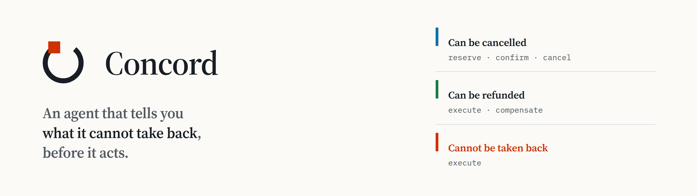

<picture>
  <source media="(prefers-color-scheme: dark)" srcset="brand/concord-banner-dark.png">
  
</picture>

### WebMCP tells an agent what a site can *do*. Nothing tells it what a site can *take back*.

Concord is that missing layer — and the first agent that is structurally
incapable of overpromising.

**Live: <https://concord-coordinator.vercel.app>** ·
[is WebMCP native here?](https://concord-coordinator.vercel.app/native.html) ·
[write a participant](https://concord-sandbox.vercel.app) ·
[conformance](https://concord-coordinator.vercel.app/conformance.html) ·
[check a receipt elsewhere](https://concord-receipts.vercel.app) ·
[SPEC](SPEC.md) ·
[THREAT MODEL](THREAT-MODEL.md) ·
[`npx concord-verify`](https://www.npmjs.com/package/concord-verify)

`inputSchema` describes a tool's shape. `readOnlyHint` describes whether it has
an effect. **Nothing in WebMCP describes whether that effect can be reversed** —
and an agent acting across several sites needs exactly that. Booking a flight on
one site and a hotel on another, it cannot know, before it starts, whether
failing halfway leaves you with a charge nobody can take back.

Today that gap is filled by a marketplace: an intermediary both sites have a
contract with, which is why one sits between almost every pair of businesses an
agent might transact with, charging 15–30% to stand there.

Concord is a convention over WebMCP by which a site declares its **commitment
surface** — *hold and release*, *commit and compensate*, or *irreversible* — and
an in-browser coordinator that computes what can honestly be promised across
several such sites **before contacting any of them**, then refuses when the
honest answer is that atomicity is not available at any price.

The intermediary does not disappear. It becomes yours: disposable, margin-free,
and unable to misreport what happened, because every statement in the receipt is
signed by the counterparty rather than by it.

---

## One minute, in your browser

Open **<https://concord-coordinator.vercel.app>**. Before you type anything, the
page has already worked out what it could promise for a flight, a hotel and a
visa fee, and says so in the largest type on it.

1. Ask for **a flight, a hotel and the visa fee**. Nothing is contacted. The
   agent tells you what it can promise: two of the three can be taken back, one
   cannot, and the one that cannot goes last.
2. Open your tool inspector. **`concord_commit` is not there.** Click *Accept
   this guarantee* and it appears. That is not a UI state — it is
   `registerTool`, and the click is the only thing that can cause it.
3. Ask for **a flight, the visa fee and the entry permit** — two things nobody
   can undo. It refuses, says nothing was contacted, and there is no button on
   that answer.
4. Press **Go ahead, then kill the coordinator**. It stops two calls in, holding
   a real hold and a real charge. Reload. The page finds the outstanding work,
   asks each vendor what actually happened, and puts back what can be put back.
5. Download the receipt and open it on
   [**an origin that is not ours**](https://concord-receipts.vercel.app). It
   verifies there, and tells you which origins it had to contact to decide — the
   coordinator is not one of them.

Six independent businesses, each its own deployment on its own HTTPS origin —
[Northwind Air](https://concord-fly.vercel.app),
[Rowan House](https://concord-stay.vercel.app),
[Consular Fee](https://concord-visa.vercel.app),
[Entry Permit](https://concord-permit.vercel.app),
[Meridian Holdings](https://concord-meridian.vercel.app),
[the Sandbox](https://concord-sandbox.vercel.app). Separate projects, separate
origins, separate signing keys held by each vendor's own backend. The browser
boundary between them is the real one; six paths on one host would have been a
lie about the only thing this project claims.

## The permission is the registration

The blocker for agentic commerce was never capability — models have been calling
tools for a while. The blocker is that **an agent cannot make a promise it is
able to keep.** It says "I've booked your trip" having booked half of it,
because nothing underneath it can compute what is actually being risked.

Concord computes exactly that, and publishes it over WebMCP — where the set of
registered tools *is* the permission model, and it is live:

```
boot                     list_vendors  inspect_vendor  propose_commitment  get_surface
the agent proposes       … + explain_guarantee
the agent explains it    … unchanged. explaining is not consent
▸ a person clicks Accept … + concord_commit        ← it did not exist until now
the commitment begins    … − concord_commit        ← and it does not exist again
```

`concord_commit` is not disabled when you may not commit. It is **not
registered**. `AbortController` is the only unregister WebMCP has, so a tool
that must not be callable is a tool that is not there — and `toolchange` fires
on every line above, so an agent watching this surface finds out the same way
you do.

There is no tool that grants that permission and there is not going to be one.
A person accepts by clicking on the page, and what they accept is identified by
the SHA-256 of the exact guarantee they were shown — so an agent that proposes
twice cannot carry an acceptance from the first to the second, and a page
displaying one set of promises cannot arm another.

- **Nothing here spends anything.** There is no `send_funds`. The only effectful
  tool is `commit`, and it will only run a plan the ladder already guaranteed.
- **A refused plan yields nothing committable at all**, and explaining a refusal
  in full does not conjure one.
- **One state in thirty-two** permits committing. A unit test sweeps all of
  them; [`evals/surface.mjs`](evals/surface.mjs) walks the real thing in a
  browser through the same `getTools()` an agent would call.

The safety is not in the prompt. Delete the prompt and the refusal is identical,
because it lives in the shape of the surface rather than in anyone's
instructions. An agent cannot overpromise here because the words for it do not
exist.

## It runs on the real API

**`provider=native`, Chrome 151, against the live deployment.** The integration
suite passes 20/20, five participants reach conformance L3, the surface matrix
passes, and a commitment completes across separate HTTPS origins with a receipt
that verifies on a different origin again.

Running it natively found two things a polyfill could never have surfaced, which
is the whole argument for doing it:

- **The coordinator was not delegating `tools` to the origins it embeds.**
  `allow="tools"` delegates a feature the *embedder* already has, and the
  coordinator's `Permissions-Policy` named only itself. Every participant
  registered its tools happily, the coordinator saw none of them, and there was
  no error anywhere. Under a polyfill that enforces none of this, it worked
  perfectly.
- **Chrome returns `inputSchema` as a JSON string**, where the polyfill returns
  the object. Reading `.properties` off it yields nothing, so anything driving a
  tool from its own declaration silently sent no arguments.

Check it on your own machine:
[**is WebMCP native here?**](https://concord-coordinator.vercel.app/native.html)
reports which implementation your browser has, then checks each behaviour this
project depends on — `exposedTo`, `getTools({fromOrigins})`, whether
`executeTool` takes a JSON string, duplicate-name rejection, `AbortSignal`
revocation, `toolchange`.

Where WebMCP is absent, `shim/adapter.mjs` falls back to a spec-faithful
polyfill and **says so on every run**. A green suite against the shim proves the
logic and proves nothing about the platform, so the two are never reported as
the same thing.

## The hard part is refusing to lie

A saga over irreversible steps is not atomic. Discovering that *after* the
failure is the difference between a demo and a system, so Concord classifies
what each vendor can actually commit to and computes the guarantee **before
anything is contacted**.

| Rung | Declares | Meaning |
|---|---|---|
| **reservable** | `reserve` + `confirm` + `cancel` | Nothing observable happens until every participant agrees |
| **compensable** | `execute` + `compensate` | The effect happens and is then reversed — a charge appears and refunds |
| **irreversible** | `execute` only | Once done, done |

From that, one of four honest answers:

- **atomic** — every vendor holds a reservation
- **compensated** — some effects become briefly real, then reverse
- **bounded** — one irreversible step, ordered last, everything before it unwinds
- **refused** — no promise is available, and nothing is contacted

Two irreversible vendors is the refusal case: if the second fails, nothing can
undo the first. Concord says so and stops. An irreversible step that something
must *follow* is refused for the same reason.

## Write a participant yourself

The reasonable suspicion about a demo like this is that it is a few hardcoded
pages talking to each other. The [**sandbox**](https://concord-sandbox.vercel.app)
is the answer: its own origin, a text box, and ten lines.

```js
concord({
  id: 'lounge',
  title: 'Skyline Lounge',
  steps: {
    reserve: { tool: 'hold_pass',  ttlSeconds: 600, run: ({ guests }) => ({ ref: id(), guests }) },
    confirm: { tool: 'issue_pass', run: ({ ref }) => ({ ref, issued: true }) },
    cancel:  { tool: 'drop_hold',  run: ({ ref }) => ({ ref, released: true }) },
  },
});
```

Press **Run**. The coordinator has never heard of it and says so:

> Skyline Lounge registered a commitment surface at https://concord-sandbox.vercel.app.
> I had never heard of it until now, and I can include it from here.

Ask for *a flight and a Skyline Lounge pass* and you get **all-or-nothing up to
the final confirm**. Then delete the `cancel` step and ask again:

> **This is not a promise I can make.**
> lounge declares only reserve, confirm, status, which is not a commitment
> protocol anything can be promised over.

Nothing was redeployed and nothing was configured. A hold you cannot release is
not a hold, and the guarantee follows the declaration rather than the other way
round.

## Phase order is the safety property

```
1 reserve    every reservable vendor takes a hold          cancellable
2 execute    every compensable vendor commits              reversible, visibly
3 commit     the one irreversible step runs                point of no return
4 confirm    reservations become bookings
```

Confirm comes last deliberately. A confirmed reservation cannot be cancelled, so
confirming before the irreversible step would strand it if that step failed.
This leaves exactly one operation after the point of no return, and it is the
one the vendor has already promised to honour.

It can still fail. Then there is no unwind, and pretending otherwise would be
the lie this design exists to prevent: the saga retries confirm under the same
idempotency key, and if that is exhausted it reports **IN DOUBT**, naming what
is stranded and what becomes of it. Failed compensations are recorded the same
way — someone has to fix those by hand.

## Surviving the coordinator

A saga held in memory is a demo. Close the tab after Rowan House has been
charged and $567 is stranded, with nothing anywhere that knows to undo it.

So intent is written **before** each call, not after. The distinction is the
whole point: a log of outcomes cannot tell *"about to reserve"* from *"never
reserved"*, and those need opposite recoveries.

```
intent   stay.execute   key saga_8h.stay.execute
                        ← the coordinator dies here
```

That leaves an intent standing alone, which is exactly right — the process
stopped between the call and the reply, so only the vendor knows whether it
acted. Two consequences follow, and both are enforced:

- **A dead process unwinds nothing.** There is nothing left running to do it.
- **A dead process writes nothing**, including "this call failed". Only a live
  coordinator records a failure.

Recovery does not guess. The idempotency key was journalled before the call, and
every vendor exposes `concord.status` — *did you ever honour this key* — which
performs nothing. So the coordinator asks, and only then decides what to undo. A
vendor declaring no status step is reported **unresolved**, never assumed:
assuming it did not happen strands the charge, and assuming it did refunds a
booking that was never made.

Press **Go ahead, then kill the coordinator** on the coordinator page. It stops
two calls in, with the hotel charged. Reload, and the page shows what is
outstanding — separating what the journal can *prove* from what only the vendor
knows — and offers to ask:

| Party | Step | What the journal proves | What the vendor said |
|---|---|---|---|
| Northwind Air | reserve | it happened | undone, via cancel |
| Rowan House | execute | unknown; the intent was written and no result was | undone, via compensate |

Building that screen ran the path end to end for the first time and found two
real bugs in the participants — a vendor that remembered *that* it had charged
you and had forgotten *what*, and storage that corrupted a `Map` into `{}` so a
release failed during recovery. `npm run check` now crashes a commitment,
reopens in the same browser profile, and requires everything outstanding to come
back undone.

## The participants

Six independent businesses with no relationship to each other. None has an API
with another; none knows the others exist. Each is its own product, with its own
colour and its own lettering — an airline is not set in the same face as a
consulate.

| | | |
|---|---|---|
| **Northwind Air** `:5177` | reservable | Holds a seat 15 minutes, then tickets or releases it |
| **Rowan House** `:5178` | compensable | Books and charges immediately; cancels with a full refund |
| **Consular Fee** `:5179` | irreversible | Declares no `compensate`, because inventing one would be a lie |
| **Entry Permit** `:5180` | irreversible | A second one, so the refusal is real rather than staged |
| **Meridian Holdings** `:5181` | compensable, and lying | Declares it can reverse what it does. It cannot |
| **Sandbox** `:5182` | whatever you write | Write a participant live and watch the guarantee follow it |

Each answers one question through a `concord.protocol` tool — *what can you
commit to* — and everything else is derived from the answers.

Every vendor carries operator switches that break any step on demand. Failure
injection is a feature of the system, not a mode of the test harness: break the
consular fee mid-commitment and watch the hotel refund and the seat release, on
the vendors' own pages.

**Meridian Holdings lies on purpose.** It declares `compensable` and then refuses
to compensate, keeping the money. Concord cannot prevent that and does not claim
to. What it does is make the lie *attributable*: Meridian's own signature is on
the statement it later declines to reverse.

## The receipt

Afterwards each party knows only its own half. Northwind knows it ticketed a
seat; Rowan House knows it charged and refunded. Neither knows what happened
elsewhere, and neither has any reason to trust the coordinator's account — the
coordinator is the traveller's agent, and it is the one party with a motive to
misreport.

So the receipt is a Merkle tree of statements, each signed by the party that made
it, with the signature kept *outside* the leaf. That separation is what lets the
verifier distinguish **"this record was altered"** from **"this vendor never said
that"** — collapse them into one hash and both become the same indistinguishable
accusation.

Each vendor signs the shape of the whole commitment, not just its own part. Sign
only your own part and a coordinator can drop one of a vendor's two statements
and rebuild the receipt around the rest: every party is still represented, so
nothing objects. Attesting to the whole means the survivors testify that
something is missing.

### Check one somewhere we do not run

The receipt panel on the coordinator says VERIFIED, and it was drawn by the same
page that produced the receipt — which is the arrangement a receipt exists to
make unnecessary. So there is an eighth origin,
[**concord-receipts.vercel.app**](https://concord-receipts.vercel.app), and it is
defined by what it is not: it ships the receipt code, a page, and the palette.
No coordinator, no participants, no WebMCP. It registers no tools, publishes no
key because it signs nothing, and serves `Permissions-Policy: tools=()`.

Click **Check it on another origin** and it opens there with the receipt in the
URL fragment, which never reaches a server. What it shows is not really the
verdict:

```
Every origin this page contacted, in the order it contacted them
  https://concord-fly.vercel.app/.well-known/concord.json  — answers to "fly"
  https://concord-stay.vercel.app/.well-known/concord.json — answers to "stay"
  https://concord-visa.vercel.app/.well-known/concord.json — answers to "visa"

https://concord-coordinator.vercel.app is not in that list. The coordinator
that produced this receipt was not asked anything, and could not have changed
this answer.
```

Or do it at a terminal, with nothing of ours installed:

```bash
URL=https://concord-coordinator.vercel.app/ npm run export receipt.json
npx concord-verify receipt.json
```

```
  resolving fly → https://concord-fly.vercel.app/.well-known/concord.json
  ✓ fly     reserve    in tree yes   signed yes   key in force
  ✓ stay    execute    in tree yes   signed yes   key in force
  ✓ visa    execute    in tree yes   signed yes   key in force
  ✓ fly     confirm    in tree yes   signed yes   key in force

VERIFIED — 4/4 statements signed by the party named and provably part of this receipt.
```

[`concord-verify`](https://www.npmjs.com/package/concord-verify) is published, so
it runs from the registry on a machine with nothing installed. It reads the file,
fetches each vendor's key from that vendor's own origin over TLS, and checks
every statement was signed by the party it names, with a key that was entitled to
sign at the time.

Edit what a vendor charged and it says the entries do not hash to the stated
root, naming the entry that moved. Remove the statement proving the flight was
ticketed and rebuild the receipt around what is left, and it says the receipt
does not account for the whole commitment its own participants signed up to.
Both exit non-zero. `--explain` prints the algorithm as it runs.

## Running it yourself

```bash
npm run dev     # eleven origins: the coordinator, six participants,
                # the receipt verifier, and Ring 0's three
```

Then open <http://localhost:5173/concord.html> and break a vendor while it runs.

```bash
npm test                          # the protocol, without a browser
npm run check                     # everything CI would run, end to end
npm run surface                   # what an agent may call, in every state
npm run probe:concord             # the protocol against real origins
npm run conformance               # every participant against the specification
npm run export receipt.json       # ask the agent, accept, write the receipt out
npm run verify receipt.json       # check it, with nothing from the coordinator
```

**Requirements.** Node 20+, and Chrome for the probes. Chrome 149+ with the
WebMCP origin trial (or `chrome://flags/#enable-webmcp-testing`) to run against
the native API.

## Tests

**98 assertions with no browser**, six browser suites against real origins, and
two end-to-end round trips that had never been checked before they were written.

The protocol core is pure and tested without a browser: ordering, reverse unwind,
idempotency keys stable across retries, in-doubt reporting, failed compensation
surfaced, refusal *before* any vendor is contacted, inclusion at every tree size,
and every receipt forgery in the threat model.

Three of them are worth naming, because each checks a claim that would otherwise
only be a sentence in this file:

- **[`evals/surface.mjs`](evals/surface.mjs)** drives the real page and asserts
  the exact set of tool names in every state, through the same `getTools()` an
  agent calls. Verified it can fail: registering `commit` at boot trips four
  checks, treating explaining as consent trips one, and adding a tool named
  `concord_accept` trips four.
- **The receipt round trip** runs a commitment, hands the receipt to the verifier
  origin, and requires an honest one to pass there and a tampered one to fail —
  with the coordinator contacted neither time.
- **[`app/contrast.test.mjs`](app/contrast.test.mjs)** reads the colour tokens out
  of `ui/instrument.css` and puts every pair that carries meaning through the
  WCAG formula against both grounds in both themes. A token edited to something
  unreadable fails the build rather than the reader.

`deploy/verify-live.mjs` confirms each deployed origin answers, carries the
headers the cross-origin path needs, publishes a key that does not change between
requests, and **signs with the key it publishes** — and that the verifier origin
delegates `tools` to nobody and publishes no key at all.

## The protocol, written down

- **[SPEC.md](SPEC.md)** — the convention as a protocol document: the
  declaration, the ladder, guarantee computation, phase order, attestation, key
  publication, the receipt, the exact algorithm a verifier must run, and §14, the
  coordinator's surface — which tools may be registered when, normatively. Its
  §16 is the unresolved problems, written down rather than hedged; §17 proposes
  the reversibility annotation upstream.
- **[THREAT-MODEL.md](THREAT-MODEL.md)** — who is trusted for what, the attacks
  that are closed with the verifier's exact response to each, and the ones that
  are not.
- **[spec/conformance.mjs](spec/conformance.mjs)** — a suite that checks a live
  participant against the specification and reports which level it meets. Every
  line names the section it enforces.

Open **<https://concord-coordinator.vercel.app/conformance.html>** to run it
against the live participants, in your browser, with nothing installed — and
**there is a box: put your own origin in it.** Five participants reach **L3 —
attesting**: they declare a commitment surface, can be asked afterwards what
happened, are idempotent under a repeated key, and sign statements against a key
published on their own origin. The suite exercises those rather than assuming
them — it calls a step twice and compares, asks the status probe about a key it
has never seen, and verifies a real signature against the real key document.

## Known limits

Stated here rather than left to be found.

**A confirm fan-out can partially commit.** With several reservable vendors,
confirming is a sequence: a late failure leaves earlier confirms standing. That
is ordinary two-phase commit and cannot be removed without a coordinator both
sides trust, which is the thing this design says does not exist. The plan says so
before you commit, and the outcome names exactly what stands.

**The signing endpoint still takes its result from the page.** It will only sign
for its own vendor at its own origin, and only for same-origin requests, so a
compromised page cannot forge another party's word. But it remembers which
idempotency keys it has signed in *process memory*, and on a serverless host two
invocations each believe they are the first — so it cannot reliably stop a
compromised page restating its own. What holds instead is a check at
verification: two statements under one idempotency key are two accounts of the
same step, and a receipt containing both is rejected. Closing it properly means
holding the vendor's transaction record server-side and building the statement
from it. That is the port a production deployment has to make.

**Vendors keep their books in the browser.** They survive a reload, which is what
recovery depends on, and they are still `localStorage` — so a user can edit them,
and a private window is a vendor with no memory. Real vendors have databases.
That is a property of these reference participants rather than of the protocol,
and it is the same port as the paragraph above.

**A participant can lie about its commitment surface**, and no protocol can
prevent it. Meridian Holdings demonstrates it on the live deployment. The result
is IN DOUBT, the failure is recorded, and the participant's own signature is on
the statement it declined to reverse.

## Layout

```
concord/ladder.mjs        the commitment ladder — what can honestly be promised
concord/saga.mjs          the executor: phase order, deadlines, unwind
concord/journal.mjs       write-ahead log, durable across reloads
concord/recover.mjs       resolving a commitment its coordinator did not finish
concord/receipt.mjs       Merkle receipts, inclusion proofs, key validity
concord/agent-surface.mjs the permission model: which tools may exist, when
concord/client.mjs        binds the protocol to WebMCP
concord/*.test.mjs        the protocol proved without a browser

app/concord.html          :5173 — the coordinator, and the agent
app/reconciler.mjs        registration as the permission system
app/native.html           what your browser's WebMCP actually does
app/conformance.html      any origin against the specification, including yours
app/contrast.test.mjs     the palette, checked against the stylesheet itself
evals/surface.mjs         the tool surface, asserted state by state in a browser

verifier/                 :5183 — a receipt checked where we do not run
vendors/fly    :5177      reservable — hold, ticket, release
vendors/stay   :5178      compensable — book and charge, cancel and refund
vendors/visa   :5179      irreversible — declares no compensate, because there is none
vendors/permit :5180      a second irreversible, so the refusal is real
vendors/shady  :5181      declares it can reverse what it does, and cannot
vendors/byo    :5182      the sandbox — a participant you write, live

kit/vendor.mjs            what every participant gets: protocol declaration,
                          idempotency, signing, status, break switches
kit/keystore.mjs          signing keys, published at /.well-known/concord.json
kit/canonical.mjs         RFC 8785 serialisation, so a stranger reaches the same bytes

ui/instrument.css         one palette, one type scale, shared by every page
brand/                    the mark, and the script that draws it
demo/RECORDING.md         how to record and cut the demo, step by step
demo/cards/               title, section and end cards, and lower thirds
demo/timing.mjs           does the demo still fit in three minutes
shim/webmcp.mjs           spec-faithful WebMCP for browsers that lack it
shim/adapter.mjs          native-first resolution; reports which provider you got
server.mjs                eleven origins, with the headers the real API needs
deploy/verify-live.mjs    the deployment is usable, checked from outside

ring0/                    the capability kernel Concord was built on — a different
                          argument, kept because it is where several of these
                          ideas were worked out
experiments/              a documented negative result
```

## Brand

<picture>
  <source media="(prefers-color-scheme: dark)" srcset="brand/concord-mark-dark.svg">
  
</picture>

The mark is a return path that cannot close. The ring is the round trip —
everything given back, everything as it was. The solid square is where that
stops, and it is the only part of the mark that is a different colour, because
it is the only part that means something the ring does not.

Reversibility is the one thing colour is allowed to mean here. Blue is *can be
released*, green is *can be reversed*, red-orange is *cannot be undone* — and
green never means "success" anywhere in this project, because a committed
irreversible step succeeded and still cannot be taken back.

```
brand/concord-mark.svg          monochrome, inherits currentColor
brand/concord-mark-color.svg    the primary mark (and -dark)
brand/concord-ladder.svg        the ring drawn as the three rungs — explanatory,
                                not a logo: three colours at logo size read as a
                                progress ring, which is what this must not be
brand/concord-lockup.svg        mark and wordmark, outlines, no font required (and -dark)
brand/favicon.svg               adapts to the reader's colour scheme
brand/concord-banner.png        the image at the top of this file (and -dark)
brand/build.py                  redraws all of it, from the geometry and the font
```

The wordmark is outlined from `ui/fonts/serif-600.woff2` — the same Source Serif
4 SemiBold the site serves — so it needs no font installed and cannot render as a
substitute face. Ink `oklch(23% 0.015 250)`, paper `oklch(98.5% 0.004 95)`, the
terminal `oklch(56% 0.20 35)`.

## For judges

**[SUBMISSION.md](SUBMISSION.md)** — the four required answers, the objections
answered before they are raised, and every link in one place.

MIT.
