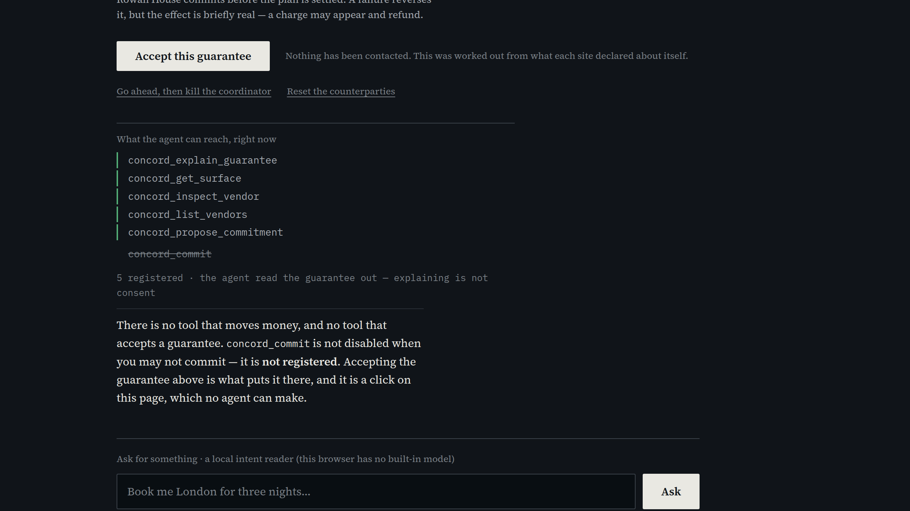

# Recording the demo

Everything here assumes you have never edited a video before. Follow it in
order. Total time: about ninety minutes, most of it re-takes.

**The rules you must not break** (from the Devpost page):

- Under **3 minutes**. Aim for **2:45**. A 3:01 video can be disqualified.
- **Public** YouTube video. Not unlisted, not private.
- It must have **audio**, and the audio must cover **what you built** and
  **how you used WebMCP**.
- The live URL, the repo and the licence are separate submission fields — the
  video does not have to show them, but the end card does anyway.

---

## Part 1 — Set up (20 minutes, once)

### 1.1 Install the two programs

Open a terminal and paste these one at a time.

```bash
sudo apt update
sudo apt install -y obs-studio kdenlive
```

- **OBS Studio** records your screen.
- **Kdenlive** cuts the recording together. (If you already know DaVinci
  Resolve, use that instead — the steps are the same idea.)

### 1.2 Get a Chrome that has real WebMCP

The demo must run on **native WebMCP**, not the polyfill. You already have a
Chrome 151 on this machine. Check it:

```bash
/home/dflame/.cache/ms-playwright/chromium-1234/chrome-linux64/chrome --version
```

It should print `Google Chrome for Testing 151…`. If that path is gone,
download a fresh one from <https://googlechromelabs.github.io/chrome-for-testing/>
and use the new path everywhere below.

### 1.3 Make a clean recording profile

You do not want your bookmarks, your extensions, or your logged-in accounts in
the video. Make a throwaway profile once:

```bash
mkdir -p ~/concord-demo-profile
```

### 1.4 The launch command

**Save this. You will run it before every take.**

```bash
/home/dflame/.cache/ms-playwright/chromium-1234/chrome-linux64/chrome \
  --user-data-dir=$HOME/concord-demo-profile \
  --window-size=1920,1080 \
  --window-position=0,0 \
  --force-device-scale-factor=1 \
  --hide-crash-restore-bubble \
  --no-first-run \
  --disable-features=Translate \
  https://concord-coordinator.vercel.app/
```

> **The one URL to have open before you start:**
> <https://concord-coordinator.vercel.app/judge.html> — it has a link to every
> state you are about to record, so you never type into the address bar on
> camera.

When it opens:

1. Press **F11** to go full screen. No tabs, no address bar, nothing but the
   page. This is what makes it look like a product instead of a browser.
2. Press **Ctrl and +** three times, until the zoom indicator says **150%**.
   At 150% the text fills the frame and is readable on a phone.
3. Press **Ctrl and Shift and M**? **No.** Do not open device emulation.

> **Check the page is on native WebMCP before you record anything.** Go to
> <https://concord-coordinator.vercel.app/native.html>. The big line must say
> **NATIVE WebMCP is present** in green. If it says the polyfill would be used,
> you are on the wrong Chrome — go back to 1.2.

### 1.5 Set up OBS

Open OBS Studio. It may run a wizard — choose **Optimize just for recording**.

1. Bottom right, click **Settings**.
2. **Video** → set *Base (Canvas) Resolution* and *Output (Scaled) Resolution*
   both to **1920x1080**. *Common FPS Values* → **30**.
3. **Output** → *Output Mode* → **Simple**. *Recording Quality* → **High
   Quality**. *Recording Format* → **MP4**. *Encoder* → **Software (x264)**.
4. **Audio** → leave it. You are recording the voice separately.
5. Click **OK**.

Now add what it should capture:

6. In the **Sources** box (bottom middle), click **+** → **Screen Capture
   (PipeWire)** → **OK** → pick your monitor → **Share**.
7. Right-click the **Mic/Aux** slider in the **Audio Mixer** and choose
   **Mute**. Silence now, voice later. This is much easier than talking and
   clicking at the same time.

---

## Part 2 — Record the screen (30 minutes)

You are recording **five separate clips**. Short clips are far easier than one
long take: if you fumble at 2:30 you only redo twenty seconds.

Before **every** clip:

- Run the launch command from 1.4 (fresh profile every time = no leftover state)
- **F11** full screen, **Ctrl +** to 150%
- Click **Reset the counterparties** on the coordinator and wait 2 seconds
- In OBS click **Start Recording**, wait **2 seconds doing nothing**, then act
- At the end, wait **2 seconds doing nothing**, then **Stop Recording**

Those two seconds of stillness at each end are the handles the editor needs.
Without them every cut feels rushed.

Your clips land in `~/Videos`. Rename each one right after you record it.

---

### Clip 1 — `01-guarantee.mp4` (about 22 seconds)

**What the viewer must see:** the page already knows what it can promise before
anything is typed, and answers a real question the same way.

Open the **Ask for the trip** link on the judge page. It loads with the question
already asked.

1. The answer is on screen. The headline reads **"One of these cannot be taken
   back."** Hold still 3 seconds.
2. Scroll slowly so the ledger table is centred. Pause 3 seconds — let them read
   *cancelled · refunded · not taken back* down the middle column.
3. Scroll a little further so the two caveats under it are visible.
4. Stop.

---

### Clip 2 — `02-surface.mp4` (about 34 seconds) — **the important one**

**What the viewer must see:** `concord_commit` is not in the tool list, a human
clicks, and it appears. Do this one until it is clean.

1. Same link, fresh page, question already asked.
2. **Scroll so that the Accept button and the "What the agent can reach, right
   now" panel are both on screen at once.** This is the single most important
   framing in the video. The list should read five green tools with
   **concord_commit struck through underneath**, and the line below it:

   > `5 registered · the agent read the guarantee out — explaining is not consent`

   This is what the frame should look like — recorded at exactly the window
   size and zoom in 1.4 and 1.5, so if yours looks like this, yours is right:

   

3. Hold completely still for **4 seconds**. Do not move the mouse.
4. Move the mouse slowly to **Accept this guarantee** and click once.
5. **Do not move or scroll for 6 seconds.** `concord_commit` moves up into the
   live list in red, then disappears again when the commitment settles.
6. Scroll down slowly through the execution log to the receipt. Pause on
   **VERIFIED**.
7. Stop.

> If you fumble the framing, do it again. This clip is thirty seconds of your
> life and it is the reason a judge scores you top of the field.

---

### Clip 3 — `03-refusal.mp4` (about 20 seconds)

Open **Ask for something impossible** on the judge page.

1. The headline reads **"This is not a promise I can make."** Hold 3 seconds.
2. Scroll down slowly to the transcript, where the agent names the two vendors
   that are both irreversible.
3. Scroll to the reach panel. **There is no Accept button and no
   `concord_commit`.** Hold 3 seconds.
4. Stop.

---

### Clip 4 — `04-forge.mp4` (about 22 seconds)

Go to <https://concord-coordinator.vercel.app/attack.html>.

1. Hold 3 seconds on the headline: *Try to get one past it.*
2. Click **Fire all of them**. The rows fill in one at a time — do not touch
   anything while they do.
3. The headline becomes **"None of them got through."** Hold 3 seconds.
4. Scroll slowly through two or three rows so the right-hand column is
   readable. That column is what the verifier objected to, in its own words.
5. Stop.

---

### Clip 5 — `05-receipt.mp4` (about 27 seconds)

1. Fresh page, ask the trip, **Accept**, let it finish.
2. Scroll to the receipt. Hold 2 seconds on **VERIFIED**.
3. Click **Check it on another origin**. A new tab opens.
4. **F11** in the new tab, **Ctrl +** to 150%.
5. The headline says **"This receipt verifies."** Hold 3 seconds.
6. Scroll down slowly to *"Every origin this page contacted"*.
7. **Hold 5 seconds** on the bold line:
   *"https://concord-coordinator.vercel.app is not in that list."*
8. Stop.

---

### Optional — `x-crash.mp4`, if you want it instead of the forge

Killing the coordinator mid-commitment and watching it recover is the thing
nobody else in this field built. It is not in the cut because it needs a
sentence of setup about write-ahead journals before it means anything, and in a
two-minute-forty-five video an explanation-heavy beat is expensive. The forge
lands instantly and answers the same question — *is any of this real?*

If you prefer it, swap it into Clip 4's slot at the same length and use
`lt-x-crash.png` and `x-recovery.png`.

1. Ask the trip, wait for the guarantee.
2. Click **Go ahead, then kill the coordinator** (the small underlined link).
3. Wait 3 seconds — the execution log stops part way.
4. **Ctrl+R** to reload. A red-topped block appears: **"Something is
   outstanding."** with two rows.
5. Hold 4 seconds — one row says *it happened*, the other *unknown; the intent
   was written and no result was*.
6. Click **Ask each vendor what happened**. Hold 5 seconds while the right-hand
   column fills with *undone, via cancel* and *undone, via compensate*, and the
   headline turns green.
7. Stop.

---

## Part 3 — The narration (15 minutes)

Record your voice **after** the screen clips, reading this out. Your phone's
voice recorder is fine, or Audacity, or OBS with only the mic enabled.

**How to say it:** normally. Do not perform it. Pause a full second between
paragraphs — those pauses are where the edit breathes.

---

> **[Card: title — 0:00]**
>
> Every website tells an agent what it can do. Nothing tells it what it can
> take back.

> **[Clip 1 — 0:07]**
>
> This is Concord. Before it contacts anybody, it works out what it can honestly
> promise across sites that have never heard of each other. A flight that can be
> cancelled. A hotel that can be refunded. And a visa fee that cannot be taken
> back — so that one goes last.

> **[Card: the surface — 0:29]**
>
> Here is how that is enforced. Not a prompt, and not a check inside a tool.

> **[Clip 2 — 0:39]**
>
> This panel is the live output of `getTools`. Five read-only tools. The commit
> tool is not disabled — it is **not registered**. The agent has proposed and
> read the guarantee out, and it still has no way to commit, because explaining
> is not consent.
>
> Now I accept, and `registerTool` puts the commit tool on the surface. No tool
> does that — a person clicked. And the moment the commitment starts, an
> `AbortController` takes it away again.

> **[Clip 3 — 1:13]**
>
> Ask for two things nobody can undo, and it refuses. Nothing was contacted,
> there is no button, and no commit tool — a refused plan never produces one.

> **[Card: the forge — 1:33]**
>
> Every statement in the receipt is signed by the counterparty, not by us.

> **[Clip 4 — 1:41]**
>
> These are fourteen real receipts, each edited the way a coordinator with a
> motive would. Seven of them verified clean until an audit found it. The
> outcome is derived from the statements now, and you can fire these yourself.

> **[Clip 5 — 2:03]**
>
> And here is one on a different origin, which has no tools and no coordinator.
> It fetched each key from that vendor's own site. The coordinator that produced
> this receipt was never asked anything.

> **[Card: end — 2:30]**
>
> A permission model made of `registerTool` and `AbortController`, and an agent
> that cannot overpromise because the words for it do not exist.

Measured, not estimated — `npm run demo:timing` counts the words and does the
arithmetic against the edit table below. If you change a word of this, run it
again: the first draft of an earlier version was three seconds too long for its
own cut.

---

## Part 4 — Edit it (30 minutes)

Open **Kdenlive**.

### 4.1 Start the project

1. **Project → Project Settings**. Profile **HD 1080p 30 fps**. OK.
2. **Project → Add Clip or Folder**. Select your five `.mp4` files, the four
   `demo/cards/0*.png` cards, the seven `demo/cards/lt-*.png` lower thirds, and
   your voice recording. Open.

### 4.2 Lay the voice down first

This is the trick that makes editing easy: **the voice is the spine, and the
picture is cut to fit it.**

1. Drag your voice recording onto **Audio 1**, starting at 0:00.
2. Play it. Note the time each paragraph starts — write them down.

### 4.3 Lay the picture on top

Drag onto **Video 1** in this order, so each item starts where its paragraph
starts:

| Track item | Starts at | Length |
|---|---|---|
| `01-title.png` | 0:00 | 7s |
| `01-guarantee.mp4` | 0:07 | 22s |
| `02-surface.png` | 0:29 | 10s |
| `02-surface.mp4` | 0:39 | 34s |
| `03-refusal.mp4` | 1:13 | 20s |
| `03-forge.png` | 1:33 | 8s |
| `04-forge.mp4` | 1:41 | 22s |
| `05-receipt.mp4` | 2:03 | 27s |
| `04-end.png` | 2:30 | 15s |

To make a clip shorter, drag its right edge left. To cut a boring middle, put
the playhead there, press **Shift+R** to razor, click the piece you do not want,
press **Delete**, then drag the right piece left to close the gap.

**Speed up the slow bits.** If a clip has five seconds of nothing happening,
right-click → **Change Speed** → 150% or 200%. Do this to scrolling. Never do it
to the moment in Clip 2 when the tool appears.

### 4.4 Add the lower thirds

Drag each `lt-*.png` onto **Video 2** (above Video 1). They have transparent
backgrounds, so they sit over the recording. About **4 seconds** each.

| Lower third | Put it over | Roughly at |
|---|---|---|
| `lt-1-guarantee.png` | Clip 1, on the ledger | 0:13 |
| `lt-2-nocommit.png` | Clip 2, while the list is still | 0:43 |
| `lt-3-accept.png` | Clip 2, as you click | 0:52 |
| `lt-4-appeared.png` | Clip 2, right after it appears | 0:57 |
| `lt-5-refused.png` | Clip 3 | 1:18 |
| `lt-6-forge.png` | Clip 4, after the rows finish | 1:50 |
| `lt-7-verified.png` | Clip 5, on the "is not in that list" line | 2:20 |

### 4.5 The one piece of polish worth doing

In **Clip 2**, when `concord_commit` appears, zoom in on the panel so it fills
more of the frame.

1. Click the clip. Right panel → **Effects** → search **Transform** → drag it on.
2. Keyframe at the moment you click Accept: *Size* **100%**.
3. One second later: *Size* **160%**, and drag *Position* so the tool list is
   centred.
4. Two seconds after that: back to **100%**.

That is the only effect in the whole video. Resist adding more.

### 4.6 Transitions

**Do not add transitions.** Straight cuts everywhere. The one exception: select
the first and last clip and add **Fade in** / **Fade out** (right-click → *Fade
in* / *Fade out*).

### 4.7 Check the length

Look at the total duration in the timeline ruler. **It must be under 3:00.** If
you are at 2:55, trim the pauses at the start of clips, not the content.

---

## Part 5 — Export and upload (10 minutes)

### 5.1 Export

1. **Project → Render**.
2. Choose **MP4 (H.264/AAC)**.
3. Set the output file to `~/Videos/concord-demo.mp4`.
4. Click **Render to File**. Wait.
5. **Watch the whole thing back, once, all the way through.** Check: is the
   audio in sync, is anything unreadable, is it under three minutes.

### 5.2 Upload to YouTube

1. Go to <https://youtube.com/upload>, drag the file in.
2. **Title:** `Concord — an agent that cannot overpromise (WebMCP Challenge)`
3. **Description:** paste this:

```
Concord is a convention over WebMCP by which a website declares what it can
TAKE BACK, not just what it can do — hold-and-release, commit-and-compensate,
or irreversible — and an in-browser coordinator that computes the strongest
honest guarantee across several sites BEFORE contacting any of them.

The commit tool does not exist until a person accepts the exact guarantee they
were shown. Not disabled — not registered. registerTool puts it on the surface
when a human clicks; an AbortController takes it away when the commitment
starts. There is no tool that grants that permission.

Live:            https://concord-coordinator.vercel.app
Verify a receipt: https://concord-receipts.vercel.app
Write a participant: https://concord-sandbox.vercel.app
Code (MIT):      https://github.com/iamdflame/concord

WebMCP used: document.modelContext.registerTool with per-tool AbortController
as the permission model, getTools({fromOrigins}), toolchange, exposedTo,
allow="tools" plus Permissions-Policy: tools=(...), and Origin-Agent-Cluster.
Verified on native WebMCP in Chrome 151.
```

4. **Visibility: Public.** Not unlisted. The rules say public.
5. Turn **off** "Made for kids".
6. Publish, then **open the link in a private window** to prove it is really
   public.

### 5.3 Submit on Devpost

Paste into the Devpost form:

- **Live URL:** `https://concord-coordinator.vercel.app`
- **Video:** your YouTube link
- **Repo:** `https://github.com/iamdflame/concord`
- **Text description:** copy from [`SUBMISSION.md`](../SUBMISSION.md) — it is
  already written against the four questions Devpost asks.

Then check each of these yourself:

- [ ] The video is under 3:00 and is **Public**
- [ ] The video has audio the whole way through
- [ ] The video says the words "registerTool" and "AbortController"
- [ ] The live URL opens for a stranger with no login
- [ ] The repo is public and GitHub shows **MIT** at the top of the page
- [ ] `native.html` on the live site says **NATIVE WebMCP is present**

---

## If something goes wrong on the day

**The page says the polyfill is being used.** You launched the wrong Chrome.
Use the full path in 1.4.

**A vendor panel says it did not grant its tools.** Click *Reset the
counterparties*, wait five seconds, reload.

**The commit tool does not appear when you click Accept.** Reload and ask
again — you are probably looking at a proposal that was already committed.

**You cannot get a clean take of Clip 2.** Record it in two pieces: everything
up to the click, then everything after. Cut them together. Nobody can tell.
